# 📊 Diagrama de Classes - Codex Finance

## Visão Geral da Arquitetura

```mermaid
classDiagram
    %% Componentes Vue
    class App {
        -currentView: string
        -currentViewTitle: computed
        +navigateTo(view: string): void
        +goHome(): void
    }

    class AppHeader {
        -lastUpdate: string
        -name: string
        -subtitle: string
    }

    class FilterPanel {
        -isExpanded: boolean
        -empresaSelecionada: ref
        -dataInicio: ref
        -dataFim: ref
        -categoriasSelecionadas: ref
        -contasSelecionadas: ref
        +toggleExpanded(): void
        +setQuickFilter(periodo: string): void
        +clearFilters(): void
    }

    class CashFlowView {
        -loading: boolean
        -showDetailsDialog: boolean
        -selectedDetails: object
        -linhas: ref
        -periodos: ref
        -historyData: ref
        +showDetails(categoria: string, periodo: object, valor: number): void
        +updateData(): Promise<void>
    }

    class OverdueView {
        -tipo: ref
        -tipoOptions: array
        +getDaysOverdue(vencimento: string): number
    }

    class RawDataView {
        -globalFilter: ref
        -currentPage: ref
        -rowsPerPage: ref
        +exportData(): void
        +previousPage(): void
        +nextPage(): void
    }

    %% Composables
    class useParametros {
        +categoriasSelecionadas: ref
        +contasSelecionadas: ref
        +empresaSelecionada: ref
        +dataInicio: ref
        +dataFim: ref
    }

    class useDataService {
        +data: computed
        +getAvailableCompanies(): array
        +getUniqueCategories(): array
        +getUniqueAccounts(): array
        +getFilteredData(): array
        +getDataLoadingStatus(): object
    }

    class useCashFlowData {
        +generateCashFlowData(inicio: Date, fim: Date): Promise<object>
        +getDetailsForPeriod(categoria: string, periodo: object): Promise<array>
        +getHistoryData(inicio: Date, fim: Date): Promise<array>
    }

    class useOverdueData {
        +getOverdueData(tipo: string): array
    }

    class useRawData {
        +getRawData(): array
    }

    %% Services
    class DataLoader {
        -empresasData: object
        -loadingStatus: object
        +initialize(): Promise<void>
        +loadLocalData(): Promise<void>
        +loadGoogleDriveData(): Promise<void>
        +loadApiData(): Promise<void>
        +getData(empresa: string): array
        +getAvailableCompanies(): array
        +getLoadingStatus(): object
    }

    class DataProcessor {
        +processCategories(data: array): array
        +processAccounts(data: array): array
        +filterData(data: array, ...filters): array
        +generateCashFlowData(data: array, inicio: Date, fim: Date): object
        +itemBelongsToPeriod(item: object, dataItem: Date, periodo: object): boolean
        +getDetailsForPeriod(data: array, categoria: string, periodo: object): array
        +processOverdueData(data: array, tipo: string): array
        +processRawData(data: array): array
        +generateHistoryData(data: array, inicio: Date, fim: Date): array
    }

    %% Utils
    class DateUtils {
        +formatDate(date: Date, format: string): string
        +formatDateRange(inicio: Date, fim: Date): string
        +formatPeriodTitle(inicio: Date, fim: Date): string
        +getDaysOverdue(vencimento: string): number
        +getQuickFilterDates(periodo: string): object
        +generatePeriods(inicio: Date, fim: Date): array
        +generateHistoryData(data: array, inicio: Date, fim: Date): array
    }

    class FormatUtils {
        +formatCurrency(value: number): string
        +formatNumber(value: number): string
        +formatPercentage(value: number): string
        +getValueClass(value: number): string
        +exportToCSV(data: array, filename: string, headers: array): boolean
    }

    %% Common Components
    class ValueDisplay {
        -value: number
        -type: string
        -emphasis: boolean
        +formattedValue: computed
        +valueClass: computed
    }

    class DateDisplay {
        -date: string
        -showDaysOverdue: boolean
        -allowEmpty: boolean
        +formattedDate: computed
        +daysOverdue: computed
    }

    class SummaryCard {
        -title: string
        -value: number
        -icon: string
        -color: string
        -format: boolean
        +cardClass: computed
    }

    %% Relacionamentos
    App --> AppHeader
    App --> FilterPanel
    App --> CashFlowView
    App --> OverdueView
    App --> RawDataView

    FilterPanel --> useParametros
    FilterPanel --> useDataService
    FilterPanel --> DateUtils

    CashFlowView --> useCashFlowData
    CashFlowView --> useParametros
    CashFlowView --> ValueDisplay
    CashFlowView --> DateDisplay
    CashFlowView --> DateUtils
    CashFlowView --> FormatUtils

    OverdueView --> useOverdueData
    OverdueView --> ValueDisplay
    OverdueView --> DateDisplay
    OverdueView --> DateUtils

    RawDataView --> useRawData
    RawDataView --> useParametros
    RawDataView --> ValueDisplay
    RawDataView --> DateDisplay
    RawDataView --> DateUtils
    RawDataView --> FormatUtils

    useDataService --> DataLoader
    useDataService --> DataProcessor
    useCashFlowData --> DataProcessor
    useOverdueData --> DataProcessor
    useRawData --> DataProcessor

    DataProcessor --> DateUtils
    DataProcessor --> FormatUtils
```

## Detalhamento das Classes Principais

### 1. Camada de Apresentação (Components)

#### App.vue
- **Responsabilidade**: Componente raiz, gerencia navegação entre views
- **Estado**: currentView (string)
- **Métodos**: navigateTo(), goHome()

#### Views (CashFlowView, OverdueView, RawDataView)
- **Responsabilidade**: Componentes de página específicos
- **Dependências**: Composables específicos, componentes comuns
- **Funcionalidades**: Renderização de dados, interação do usuário

### 2. Camada de Lógica (Composables)

#### useParametros
- **Responsabilidade**: Gerenciamento de estado global dos filtros
- **Padrão**: Singleton reativo
- **Exposição**: Versões read-only e read-write

#### useDataService
- **Responsabilidade**: Interface principal para acesso aos dados
- **Dependências**: DataLoader, DataProcessor
- **Funcionalidades**: Filtragem, categorização, contas

#### Composables Específicos (useCashFlowData, useOverdueData, useRawData)
- **Responsabilidade**: Lógica específica de cada view
- **Dependências**: useDataService, DataProcessor
- **Funcionalidades**: Processamento especializado de dados

### 3. Camada de Serviços (Services)

#### DataLoader
- **Responsabilidade**: Carregamento de dados de múltiplas fontes
- **Padrão**: Singleton
- **Funcionalidades**: Fallback automático, cache local

#### DataProcessor
- **Responsabilidade**: Processamento e transformação de dados
- **Funcionalidades**: Filtragem, agrupamento, cálculos

### 4. Camada de Utilitários (Utils)

#### DateUtils
- **Responsabilidade**: Manipulação e formatação de datas
- **Dependências**: date-fns

#### FormatUtils
- **Responsabilidade**: Formatação de valores e exportação
- **Funcionalidades**: Moeda, números, CSV

### 5. Componentes Comuns (Common)

#### ValueDisplay, DateDisplay, SummaryCard
- **Responsabilidade**: Componentes reutilizáveis de UI
- **Características**: Props tipadas, computed properties, estilos scoped