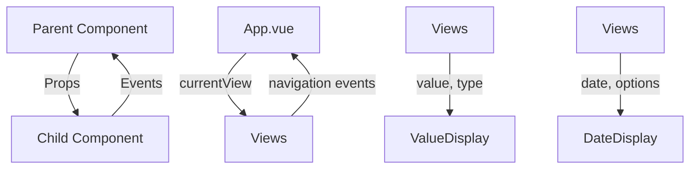
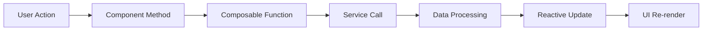
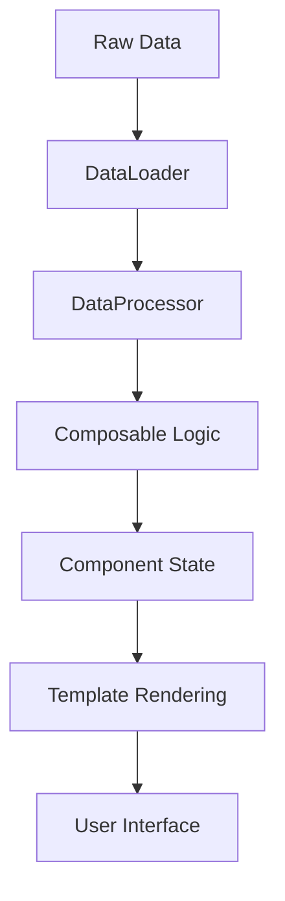

# 🧩 Diagrama de Componentes - Codex Finance

## Estrutura de Componentes Vue

```mermaid
graph TD
    %% Componente Raiz
    APP[App.vue<br/>📱 Root Component]
    
    %% Layout Components
    HEADER[AppHeader.vue<br/>🏠 Header Layout]
    
    %% Filter Components
    FILTER[FilterPanel.vue<br/>🔍 Filter Controls]
    
    %% View Components
    subgraph "📊 Main Views"
        CASH[CashFlowView.vue<br/>💰 Cash Flow Analysis]
        OVER[OverdueView.vue<br/>⚠️ Overdue Accounts]
        RAW[RawDataView.vue<br/>📋 Raw Data Table]
    end
    
    %% Common Components
    subgraph "🧩 Common Components"
        VALUE[ValueDisplay.vue<br/>💵 Value Formatter]
        DATE[DateDisplay.vue<br/>📅 Date Formatter]
        SUMMARY[SummaryCard.vue<br/>📊 Summary Widget]
    end
    
    %% Composables
    subgraph "⚡ Composables (Logic)"
        PARAMS[useParametros<br/>🎛️ Global State]
        DATA_SVC[useDataService<br/>🔄 Data Access]
        CASH_DATA[useCashFlowData<br/>📈 Cash Flow Logic]
        OVER_DATA[useOverdueData<br/>⏰ Overdue Logic]
        RAW_DATA[useRawData<br/>📄 Raw Data Logic]
    end
    
    %% Services
    subgraph "🔧 Services"
        LOADER[DataLoader<br/>📥 Data Loading]
        PROCESSOR[DataProcessor<br/>⚙️ Data Processing]
    end
    
    %% Utils
    subgraph "🛠️ Utilities"
        DATE_UTIL[DateUtils<br/>📅 Date Operations]
        FORMAT_UTIL[FormatUtils<br/>🎨 Formatting]
    end
    
    %% External Dependencies
    subgraph "📦 External Libraries"
        VUE[Vue 3<br/>⚡ Framework]
        PRIME[PrimeVue<br/>🎨 UI Components]
        DATE_FNS[date-fns<br/>📅 Date Library]
    end
    
    %% Data Sources
    subgraph "💾 Data Sources"
        LOCAL[Local JSON<br/>📁 Static Files]
        GDRIVE[Google Drive<br/>☁️ Cloud Storage]
        API[REST API<br/>🌐 Web Service]
    end
    
    %% Relationships - Component Hierarchy
    APP --> HEADER
    APP --> FILTER
    APP --> CASH
    APP --> OVER
    APP --> RAW
    
    %% Common Component Usage
    CASH --> VALUE
    CASH --> DATE
    CASH --> SUMMARY
    OVER --> VALUE
    OVER --> DATE
    RAW --> VALUE
    RAW --> DATE
    
    %% Composable Dependencies
    FILTER --> PARAMS
    FILTER --> DATA_SVC
    CASH --> CASH_DATA
    CASH --> PARAMS
    OVER --> OVER_DATA
    RAW --> RAW_DATA
    
    %% Service Dependencies
    DATA_SVC --> LOADER
    DATA_SVC --> PROCESSOR
    CASH_DATA --> PROCESSOR
    OVER_DATA --> PROCESSOR
    RAW_DATA --> PROCESSOR
    
    %% Utility Dependencies
    PROCESSOR --> DATE_UTIL
    PROCESSOR --> FORMAT_UTIL
    CASH --> DATE_UTIL
    CASH --> FORMAT_UTIL
    OVER --> DATE_UTIL
    RAW --> DATE_UTIL
    RAW --> FORMAT_UTIL
    
    %% Data Loading
    LOADER --> LOCAL
    LOADER --> GDRIVE
    LOADER --> API
    
    %% External Dependencies
    APP --> VUE
    FILTER --> PRIME
    CASH --> PRIME
    OVER --> PRIME
    RAW --> PRIME
    DATE_UTIL --> DATE_FNS
    
    %% Styling
    classDef component fill:#e1f5fe,stroke:#01579b,stroke-width:2px
    classDef composable fill:#f3e5f5,stroke:#4a148c,stroke-width:2px
    classDef service fill:#e8f5e8,stroke:#1b5e20,stroke-width:2px
    classDef util fill:#fff3e0,stroke:#e65100,stroke-width:2px
    classDef external fill:#fce4ec,stroke:#880e4f,stroke-width:2px
    classDef data fill:#f1f8e9,stroke:#33691e,stroke-width:2px
    
    class APP,HEADER,FILTER,CASH,OVER,RAW,VALUE,DATE,SUMMARY component
    class PARAMS,DATA_SVC,CASH_DATA,OVER_DATA,RAW_DATA composable
    class LOADER,PROCESSOR service
    class DATE_UTIL,FORMAT_UTIL util
    class VUE,PRIME,DATE_FNS external
    class LOCAL,GDRIVE,API data
```



## Detalhamento dos Componentes

### 🎯 **Componentes de Apresentação**

#### App.vue
```vue
Props: -
Emits: -
State: currentView, currentViewTitle
Methods: navigateTo(), goHome()
Dependencies: Layout components, View components
```

#### AppHeader.vue
```vue
Props: -
Emits: -
State: lastUpdate, name, subtitle
Methods: -
Dependencies: APP_CONFIG
```

#### FilterPanel.vue
```vue
Props: -
Emits: -
State: isExpanded, filters
Methods: toggleExpanded(), setQuickFilter(), clearFilters()
Dependencies: useParametros, useDataService, PrimeVue components
```

### 📊 **Componentes de Visualização**

#### CashFlowView.vue
```vue
Props: -
Emits: -
State: loading, showDetailsDialog, selectedDetails, linhas, periodos
Methods: showDetails(), updateData()
Dependencies: useCashFlowData, ValueDisplay, DateDisplay
```

#### OverdueView.vue
```vue
Props: -
Emits: -
State: tipo, tipoOptions
Methods: getDaysOverdue()
Dependencies: useOverdueData, ValueDisplay, DateDisplay
```

#### RawDataView.vue
```vue
Props: -
Emits: -
State: globalFilter, currentPage, rowsPerPage
Methods: exportData(), previousPage(), nextPage()
Dependencies: useRawData, ValueDisplay, DateDisplay
```

### 🧩 **Componentes Comuns**

#### ValueDisplay.vue
```vue
Props: value, type, emphasis
Emits: -
State: -
Computed: formattedValue, valueClass
Dependencies: Intl.NumberFormat
```

#### DateDisplay.vue
```vue
Props: date, showDaysOverdue, allowEmpty
Emits: -
State: -
Computed: formattedDate, daysOverdue
Dependencies: date-fns
```

#### SummaryCard.vue
```vue
Props: title, value, icon, color, format
Emits: -
State: -
Computed: cardClass
Dependencies: ValueDisplay
```

## Fluxo de Comunicação

### 📡 **Props Down, Events Up**


### 🔄 **Reactive State Flow**


### 📊 **Data Transformation Pipeline**


## Padrões de Componentes

### 🎨 **Composition API Pattern**
```javascript
// Estrutura padrão dos componentes
<script setup>
// 1. Imports
import { ref, computed, watch } from 'vue'
import { useComposable } from '@/composables'

// 2. Props & Emits
const props = defineProps({...})
const emit = defineEmits([...])

// 3. Reactive State
const state = ref(initialValue)

// 4. Computed Properties
const computed = computed(() => ...)

// 5. Methods
const method = () => {...}

// 6. Watchers
watch(state, callback)

// 7. Lifecycle
onMounted(() => {...})
</script>
```

### 🔧 **Composable Pattern**
```javascript
// Estrutura padrão dos composables
export function useFeature() {
  // Private state
  const state = ref()
  
  // Public methods
  const method = () => {...}
  
  // Computed properties
  const computed = computed(() => ...)
  
  // Return public API
  return {
    state: readonly(state),
    method,
    computed
  }
}
```

### 🎯 **Service Pattern**
```javascript
// Estrutura padrão dos services
export class Service {
  constructor() {
    this.state = {}
  }
  
  async method() {
    // Implementation
  }
  
  process(data) {
    // Processing logic
  }
}
```

## Responsabilidades dos Componentes

### 📱 **App.vue**
- Gerenciamento de rotas/navegação
- Layout principal da aplicação
- Estado global de navegação

### 🏠 **AppHeader.vue**
- Branding e identidade visual
- Informações de sistema
- Navegação principal

### 🔍 **FilterPanel.vue**
- Controles de filtro
- Estado dos filtros
- Validação de entrada

### 📊 **Views (Cash/Overdue/Raw)**
- Lógica específica da view
- Renderização de dados
- Interação do usuário

### 🧩 **Common Components**
- Formatação consistente
- Reutilização de código
- Padrões visuais

## Vantagens da Estrutura

### ✅ **Manutenibilidade**
- Separação clara de responsabilidades
- Código reutilizável
- Fácil localização de bugs

### ✅ **Escalabilidade**
- Componentes independentes
- Fácil adição de features
- Estrutura extensível

### ✅ **Testabilidade**
- Componentes isolados
- Lógica separada
- Mocks simples

### ✅ **Performance**
- Lazy loading
- Computed caching
- Reactive updates