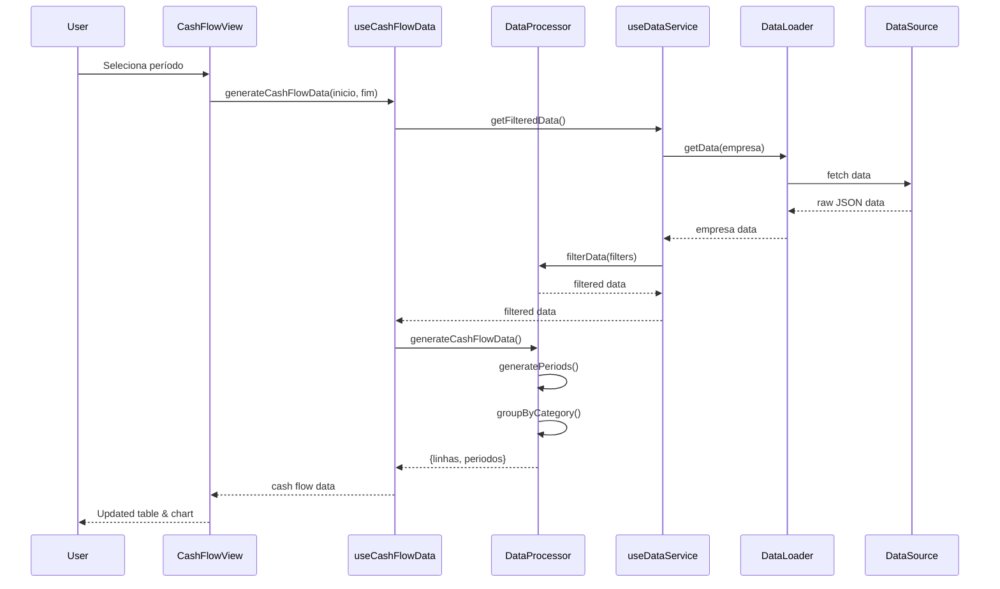
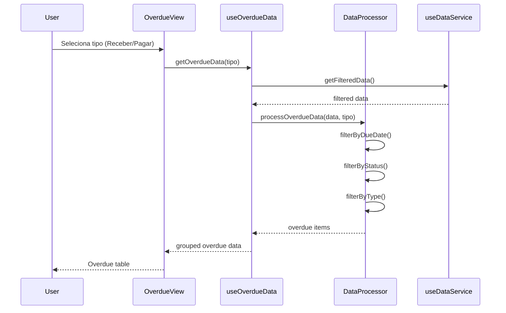
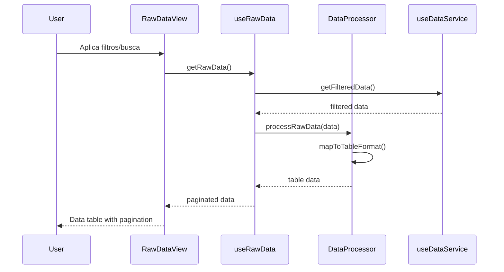
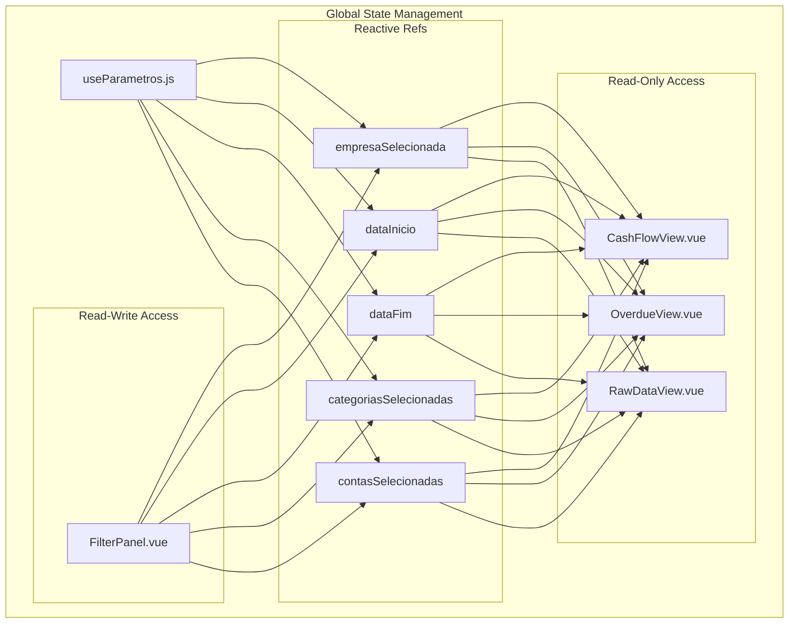
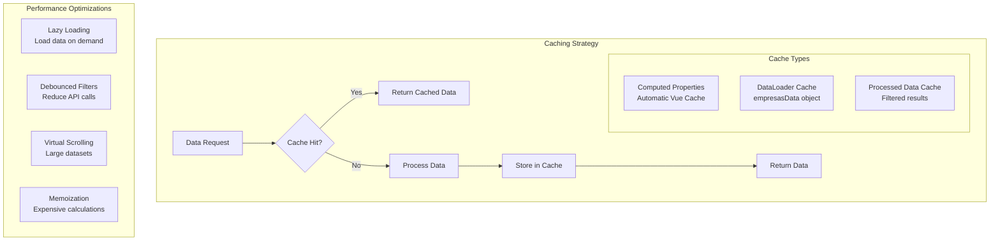
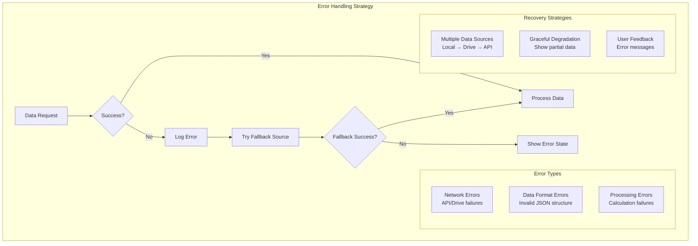

# 🔄 Diagrama de Fluxo de Dados - Codex Finance

## Fluxo Principal de Dados

```mermaid
graph TD
    %% Fontes de Dados
    subgraph "💾 Data Sources"
        LOCAL[📁 Local JSON Files<br/>Malta_Advocacia.json<br/>Codex_empreendedorismo.json<br/>fluxo.json]
        GDRIVE[☁️ Google Drive<br/>Backup Files]
        API[🌐 REST API<br/>External Services]
    end
    
    %% Carregamento de Dados
    subgraph "📥 Data Loading Layer"
        LOADER[🔄 DataLoader<br/>- loadLocalData()<br/>- loadGoogleDriveData()<br/>- loadApiData()<br/>- initialize()]
    end
    
    %% Processamento de Dados
    subgraph "⚙️ Data Processing Layer"
        PROCESSOR[🔧 DataProcessor<br/>- filterData()<br/>- processCategories()<br/>- processAccounts()<br/>- generateCashFlowData()]
    end
    
    %% Camada de Serviços
    subgraph "🔧 Service Layer"
        DATA_SERVICE[📊 useDataService<br/>- getFilteredData()<br/>- getUniqueCategories()<br/>- getUniqueAccounts()]
        CASH_SERVICE[💰 useCashFlowData<br/>- generateCashFlowData()<br/>- getDetailsForPeriod()]
        OVERDUE_SERVICE[⚠️ useOverdueData<br/>- getOverdueData()]
        RAW_SERVICE[📋 useRawData<br/>- getRawData()]
    end
    
    %% Estado Global
    subgraph "🎛️ Global State"
        PARAMS[⚙️ useParametros<br/>- empresaSelecionada<br/>- dataInicio/dataFim<br/>- categoriasSelecionadas<br/>- contasSelecionadas]
    end
    
    %% Componentes de UI
    subgraph "🎨 UI Components"
        FILTER[🔍 FilterPanel<br/>Controls & Filters]
        CASH_VIEW[📈 CashFlowView<br/>Flow Analysis]
        OVERDUE_VIEW[⏰ OverdueView<br/>Late Payments]
        RAW_VIEW[📄 RawDataView<br/>Data Table]
    end
    
    %% Fluxo de Dados
    LOCAL --> LOADER
    GDRIVE --> LOADER
    API --> LOADER
    
    LOADER --> DATA_SERVICE
    DATA_SERVICE --> PROCESSOR
    
    PROCESSOR --> CASH_SERVICE
    PROCESSOR --> OVERDUE_SERVICE
    PROCESSOR --> RAW_SERVICE
    
    PARAMS --> DATA_SERVICE
    PARAMS --> CASH_SERVICE
    PARAMS --> OVERDUE_SERVICE
    PARAMS --> RAW_SERVICE
    
    FILTER --> PARAMS
    
    CASH_SERVICE --> CASH_VIEW
    OVERDUE_SERVICE --> OVERDUE_VIEW
    RAW_SERVICE --> RAW_VIEW
    
    %% Feedback Loop
    CASH_VIEW -.->|User Interactions| PARAMS
    OVERDUE_VIEW -.->|Filter Changes| PARAMS
    RAW_VIEW -.->|Search & Pagination| PARAMS
```

## Fluxo Detalhado por Funcionalidade

### 💰 Fluxo de Caixa



### ⚠️ Contas Atrasadas



### 📋 Dados Brutos



## Transformação de Dados

### 📊 Pipeline de Processamento

```mermaid
graph LR
    subgraph "Raw Data Structure"
        A["{<br/>data_ymd: '2025-01-15',<br/>valor: 1500.00,<br/>categoria_erp_id: '001',<br/>categoria_erp_descricao: 'Receitas',<br/>pessoa_erp_descricao: 'Cliente ABC',<br/>baixado: false<br/>}"]
    end
    
    subgraph "Processing Steps"
        B[🔍 Filter by Date Range]
        C[🏢 Filter by Company]
        D[📂 Filter by Category]
        E[💳 Filter by Account]
        F[⚙️ Transform Structure]
    end
    
    subgraph "Output Formats"
        G[📈 Cash Flow Format<br/>{categoria, periodo1, periodo2, total}]
        H[⚠️ Overdue Format<br/>{categoria, pessoa, vencimento, valor}]
        I[📋 Raw Format<br/>{data_vencimento, valor_total, categoria}]
    end
    
    A --> B
    B --> C
    C --> D
    D --> E
    E --> F
    F --> G
    F --> H
    F --> I
```

### 🔄 Estado Reativo

```mermaid
graph TD
    subgraph "Reactive State Flow"
        A[User Input] --> B[Component Event]
        B --> C[Composable Method]
        C --> D[State Update]
        D --> E[Computed Recalculation]
        E --> F[Watcher Trigger]
        F --> G[Service Call]
        G --> H[Data Processing]
        H --> I[State Update]
        I --> J[UI Re-render]
    end
    
    subgraph "Example: Filter Change"
        A1[User selects date] --> B1[Calendar change event]
        B1 --> C1[setQuickFilter()]
        C1 --> D1[dataInicio.value = newDate]
        D1 --> E1[filteredData computed]
        E1 --> F1[watch dataInicio]
        F1 --> G1[updateData()]
        G1 --> H1[generateCashFlowData()]
        H1 --> I1[linhas.value = newData]
        I1 --> J1[Table updates]
    end
```

## Gerenciamento de Estado

### 🎛️ Estado Global (useParametros)



### 📊 Cache e Performance



## Tratamento de Erros

### 🛡️ Error Handling Flow



## Vantagens do Fluxo de Dados

### ✅ **Previsibilidade**
- Fluxo unidirecional de dados
- Estado centralizado
- Transformações consistentes

### ✅ **Reatividade**
- Atualizações automáticas
- Computed properties eficientes
- Watchers para side effects

### ✅ **Robustez**
- Múltiplas fontes de dados
- Fallback automático
- Tratamento de erros

### ✅ **Performance**
- Cache inteligente
- Lazy loading
- Processamento otimizado

### ✅ **Manutenibilidade**
- Separação clara de responsabilidades
- Código reutilizável
- Fácil debugging