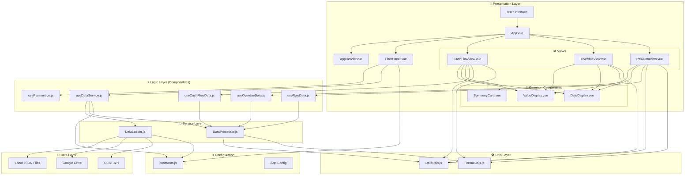
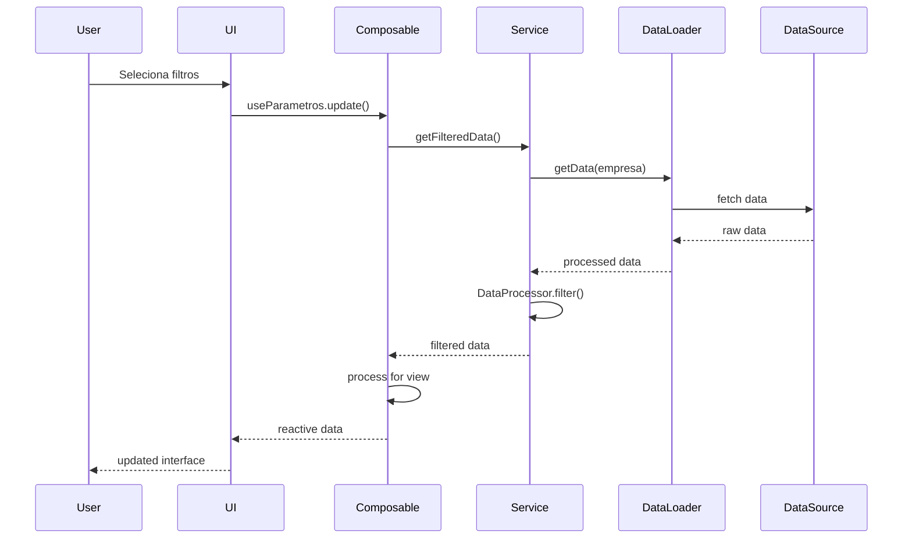

# 🏗️ Arquitetura do Sistema - Codex Finance

## Diagrama de Arquitetura Geral

## Fluxo de Dados

## Padrões Arquiteturais Utilizados

### 1. **Composition API Pattern**
- Uso de composables para lógica reutilizável
- Separação clara entre lógica e apresentação
- Reatividade granular

### 2. **Service Layer Pattern**
- DataLoader: Responsável pelo carregamento de dados
- DataProcessor: Responsável pelo processamento de dados
- Separação de responsabilidades

### 3. **Repository Pattern**
- DataLoader atua como repository
- Abstração das fontes de dados
- Fallback automático entre fontes

### 4. **Observer Pattern**
- Sistema reativo do Vue 3
- Watchers para mudanças de filtros
- Computed properties para dados derivados

### 5. **Strategy Pattern**
- Diferentes estratégias de carregamento de dados
- Processamento específico por tipo de view
- Formatação condicional

## Princípios SOLID Aplicados

### Single Responsibility Principle (SRP)
- Cada composable tem uma responsabilidade específica
- Componentes focados em uma funcionalidade
- Utils especializados

### Open/Closed Principle (OCP)
- Extensível para novas fontes de dados
- Novos tipos de filtros podem ser adicionados
- Componentes podem ser estendidos

### Liskov Substitution Principle (LSP)
- Componentes comuns podem ser substituídos
- Diferentes implementações de formatação
- Fontes de dados intercambiáveis

### Interface Segregation Principle (ISP)
- Composables específicos para cada necessidade
- Props opcionais em componentes
- APIs focadas

### Dependency Inversion Principle (DIP)
- Dependência de abstrações (composables)
- Injeção de dependências via props
- Configuração externa

## Vantagens da Arquitetura

### 🔄 **Modularidade**
- Componentes independentes e reutilizáveis
- Fácil manutenção e teste
- Desenvolvimento paralelo

### 📈 **Escalabilidade**
- Fácil adição de novas views
- Extensão de funcionalidades
- Suporte a múltiplas empresas

### 🛡️ **Robustez**
- Fallback automático de dados
- Tratamento de erros
- Validação de dados

### ⚡ **Performance**
- Lazy loading de dados
- Computed properties com cache
- Processamento otimizado

### 🧪 **Testabilidade**
- Lógica separada da apresentação
- Mocks fáceis de implementar
- Testes unitários isolados

## Fluxo de Desenvolvimento

### Adicionando Nova Funcionalidade

1. **Definir Requisitos**
   - Identificar necessidade
   - Definir interface

2. **Criar Composable**
   - Implementar lógica reativa
   - Definir API pública

3. **Implementar Processamento**
   - Adicionar métodos ao DataProcessor
   - Implementar transformações

4. **Criar Componente**
   - Implementar UI
   - Conectar com composable

5. **Integrar ao Sistema**
   - Adicionar rota/navegação
   - Atualizar configurações

### Manutenção e Debug

1. **Logs Estruturados**
   - Console logs em desenvolvimento
   - Rastreamento de fluxo de dados

2. **Vue DevTools**
   - Inspeção de estado reativo
   - Timeline de eventos

3. **Monitoramento**
   - Status de carregamento
   - Métricas de performance

## Considerações de Segurança

### 🔒 **Sanitização de Dados**
- Validação de entrada
- Escape de HTML
- Prevenção de XSS

### 🛡️ **Controle de Acesso**
- Validação de fontes de dados
- Headers de segurança
- CSP (Content Security Policy)

### 🔐 **Privacidade**
- Dados processados localmente
- Não persistência desnecessária
- Logs sem dados sensíveis